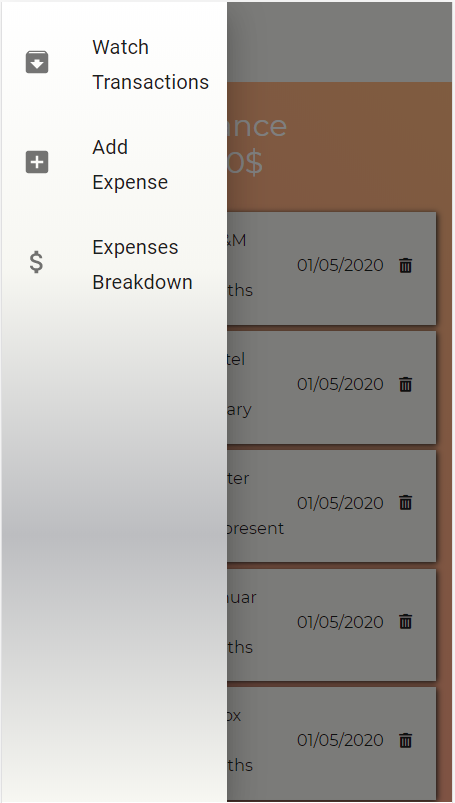

# Expenses Manager

Expenses Manager is a mobile app that enables the user to track his expenses and shows the balance for a chosen month and in total per group. This is a ReactJS full stack app that uses mongoDB to store and manage user expenses.

## Getting Started

Follow the next steps to run the app on your machine.

### Prerequisites

- Clone or download this directory.
- Install the dependencies by running npm install in the root directory.
- Run npm start

## Available features and display

- As the user enters the app a landing page is displayed

- A press on the hamburger icon leads the user to a drawer menu with the following options: add expenses, watch monthly transactions, and see a detailed list from the first record until today.

- The add expense link leads to a form, for the user to fill with the transaction details.
- If the form is complete the user can hit the "withdraw" or "deposit" button and the expense will be saved in the DB.
- If the form is not complete a snackbar will show and alert the user to fill all the fields.
- A transaction is not updated in case of internet connection loss, and/or if the user reached the limit of withdrawal. A snackbar will alert the user to check his internet connection or that he cannot withdraw more money because he reached the limit of withdrawal.

- The link "Watch expenses" shows the user a detailed list of all the transactions that have been made.

- Expenses breakdown page showes the monthly and total breakdown of the user's transactions. The transactions are grouped by category.

